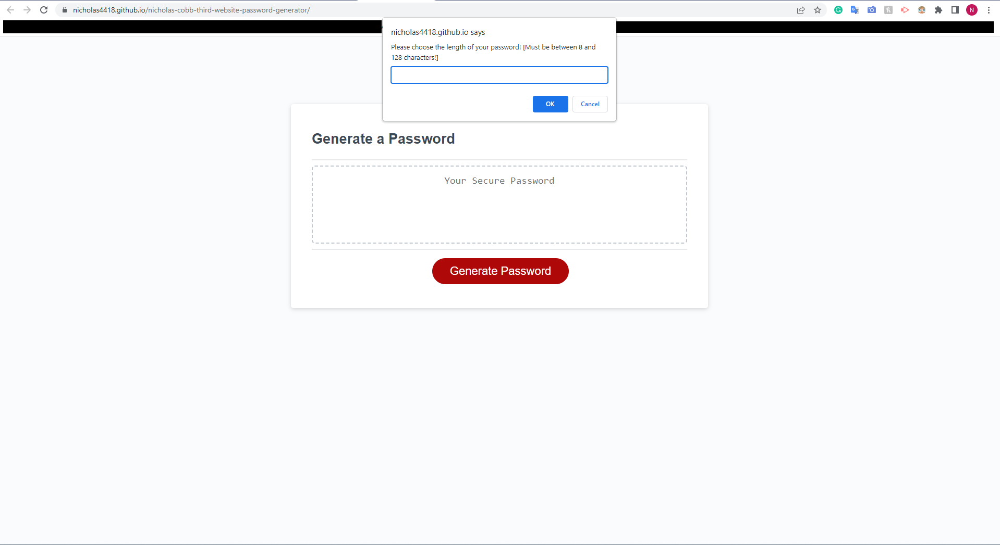

# Third Website: Javascript Password Generator

## Description

- The motivation behind this project was to refactor an existing password generator to give it proper functionality.
- I worked on this project as a means to practice using Javascript to add functionality to web pages and to familiarize myself with how Javascript can affect a website.
- The problem this project solves is that the generator had no functionality outside of a button listener. It could not perform the task that it was designed to do.
- I learned about the importance of using Javascript, specifically how it adds an extreme amount of versitility and functionality to a website.

## Installation 
- N/A

## Usage
- This project can be used as a refresher of sorts on what proper vanilla Javascript implementation looks like and how to connect a .js file to an HTML file.

## Screenshot

## Credits
- N/A

## License
- MIT License / Refer to the License in the project's repo.

## Link
- https://nicholas4418.github.io/nicholas-cobb-third-website-password-generator/